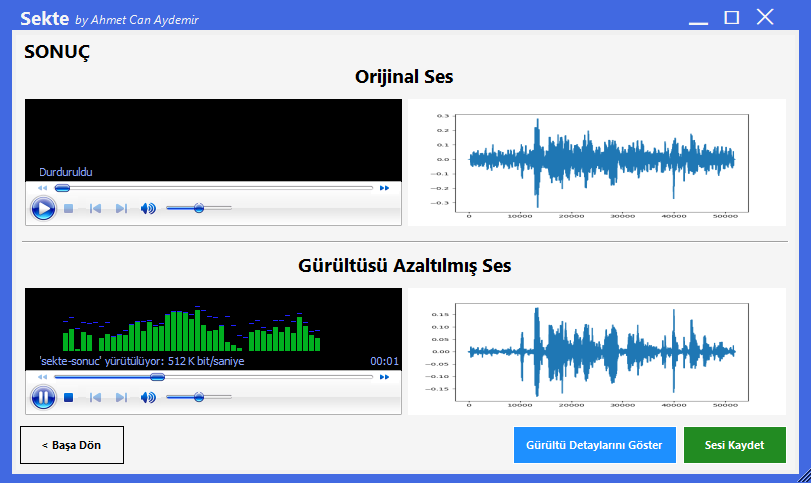
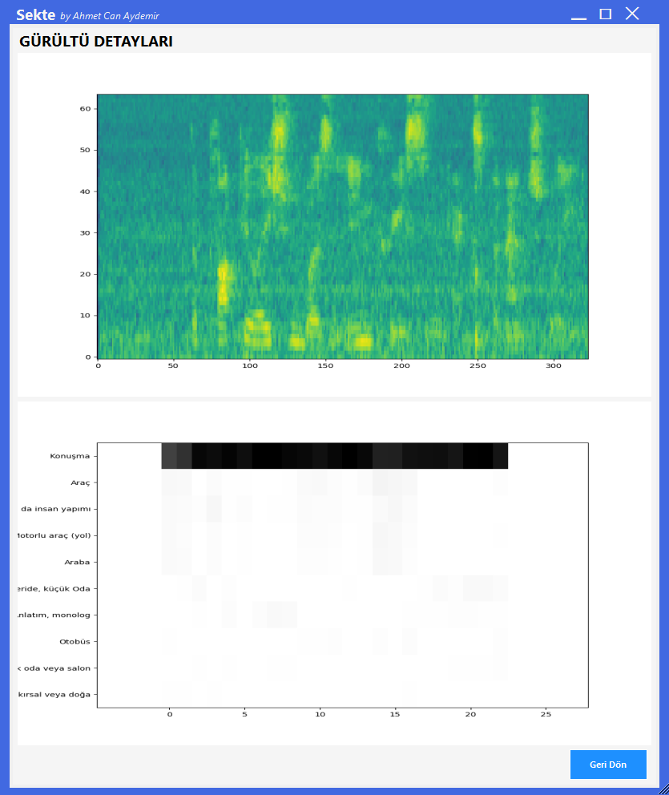

# Sekte

> Reducing the Noise in the Audio Signal by Deep Learning Methods

Sekte is a project which aims removing noise from noisy sounds with Convolutional Neural Networks machine learning model. It works like krisp.ai. Sekte also shows details of the cleaned sound with using Google's yamnet model.

This repository has a simple backend and desktop application as an example. This model can also be trained much better and run as a driver. Thus, the noise received from the microphone and speaker can be instantly eliminated.

## Project Order

1. [dataset-generator](./dataset-generator)
2. [model-generator](./model-generator)
3. [yamnet](./yamnet)
4. [backend](./backend)
5. [desktop-application](./desktop-application)

## Resources

1. DaitanGroup, 2019, How To Build a Deep Audio De-Noiser Using TensorFlow 2.0
   [medium.com/better-programming](https://medium.com/better-programming/how-to-build-a-deep-audio-de-noiser-using-tensorflow-2-0-79c1c1aea299)
2. Se Rim Park, Jinwon Lee, 2016, A Fully Convolutional Neural Network for Speech Enhancement
   [arxiv.org](https://arxiv.org/abs/1609.07132)
3. Google AudioSet
   [research.google.com/audioset/](https://research.google.com/audioset/dataset/index.html)
4. YAMNet
   [github.com/tensorflow](https://github.com/tensorflow/models/tree/master/research/audioset/yamnet)
5. Cnn-audio-denoiser [github.com/daitan-innovation](https://github.com/daitan-innovation/cnn-audio-denoiser)
6. Davit Baghdasaryan, 2018, Real-Time Noise Suppression Using Deep Learning
   [devlogs.nvidia.com](https://devblogs.nvidia.com/nvidia-real-time-noise-suppression-deep-learning/)
7. Google Colab
   [colab.research.google.com](https://colab.research.google.com)

## Additional

- [Details PDF (Turkish)](./assets/project-report-tr.pdf)

- [Short Explanation Video (Turkish)](https://drive.google.com/file/d/11j7aGxaHI8R1V09MSdZwsbA4LZe4lB80/view?usp=sharing)

## Some Images

Result

Details

